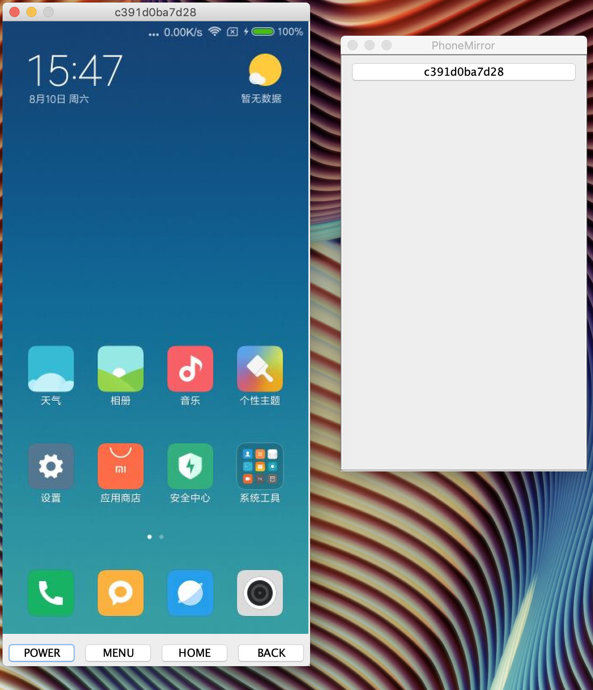

# PhoneMirror
Android手机投屏到PC，并可通过PC控制手机的java桌面工具，最低支持java6，支持同时控制多台手机。
## 应用截图

## 使用方法
* 手机连接电脑，并开启`开发者选项->USB调试`；
> 注意：<br/>
> 小米手机需要同时开启`USB调试（安全设置）`才能处理点击事件。
* 运行项目目录下的`phone-mirror.jar`
```
java -jar ./phone-mirror.jar
```

>项目运行所依赖的adb工具支持手动配置，配置方法：<br/>
>`phone-mirror.jar`同目录下创建`config.properties`文件，配置属性：`adb.path=your adb path`。
## 说明
* 手机画面同步使用了[minicap](https://github.com/openstf/minicap)库；
* 点击事件处理使用项目目录下的android工程`TouchServer`。

